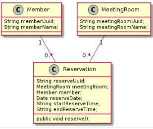

# meeting-room

## 1. 요구사항
* 정시, 30분 간격 단위로 예약
* 1회성 예약
* 주 단위 반복 예약 (반복 횟수 지정)

## 2. 사용도구
* jdk 1.8
* Springboot 2.1.3
* Spring Data JPA (+QueryDSL)
* H2
* FlywayDB
* thymeleaf (+jQuery)

## 3. 설계


### API

| METHOD | API | 설명  |
| ---------- |-------------| -----|
| GET      | /pay/v1/reservations?reserveDate={reserveDate} | 리스트 조회 |
| POST      | /pay/v1/reservations      |  예약 등록 |
| PUT | /pay/v1/reservations/{reserve-uuid}      |    예약 수정 |
| DELETE | /pay/v1/reservations/{reserve-uuid}      |   예약 삭제 |

## 4. 구현
### UI
* http://localhost:10080/meeting


### swagger
* http://localhost:10080/swagger-ui.html


## 5. 실행

```
$ mvn clean package
$ nohup java -server -d64 -Xms1g -Xmx1g -jar target/metting-room-1.0.jar 1>/dev/null 2>&1 &
```
